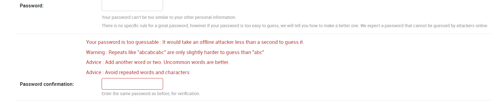
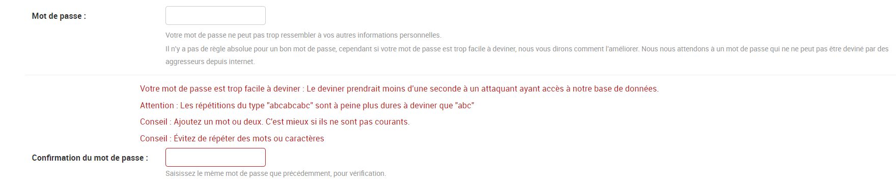

# django-zxcvbn-password-validator

A translatable password validator for django, based on zxcvbn-python and available with
pip.

Professional support for django-zxcvbn-password-validator is available as part of the
[Tidelift Subscription](https://tidelift.com/subscription/pkg/pypi-django-zxcvbn-password-validator?utm_source=pypi-django-zxcvbn-password-validator&utm_medium=referral&utm_campaign=enterprise)

[](https://travis-ci.org/Pierre-Sassoulas/django-zxcvbn-password-validator)
[](https://coveralls.io/github/Pierre-Sassoulas/django-zxcvbn-password-validator?branch=master)
[](https://badge.fury.io/py/django-zxcvbn-password-validator)

## Translating the project

This project is available in multiple language. Your contribution would be very
appreciated if you know a language that is not yet available. See
[how to contribute](CONTRIBUTING.md)

### Language available

The software is developed in english. Other available languages are :

- [x] Dutch thanks to [Thom Wiggers](https://github.com/thomwiggers/)
- [x] French thanks to [Pierre Sassoulas](https://github.com/Pierre-Sassoulas/) and
      [Lionel Sausin](https://github.com/ls-initiatives)
- [x] English

## Creating a user with django-zxcvbn-password-validator

If the password is not strong enough, we provide errors explaining what you need to do :



The error message are translated to your target language (even the string given by
zxcvbn that are in english only) :



## How to use

Add `django-zxcvbn-password-validator` to your requirements and get it with pip. Then
everything happens in your settings file.

Add `'django_zxcvbn_password_validator'` in the `INSTALLED_APPS` :

```python
INSTALLED_APPS = [
    # ...
    "django_zxcvbn_password_validator"
]
```

Modify `AUTH_PASSWORD_VALIDATORS` :

```python
AUTH_PASSWORD_VALIDATORS = [
    {
        "NAME": "django.contrib.auth.password_validation.UserAttributeSimilarityValidator",
    },
    {
        "NAME": "django_zxcvbn_password_validator.ZxcvbnPasswordValidator",
    },
    # ...
]
```

You could choose to use zxcvbn alone, but I personally still use Django's
`UserAttributeSimilarityValidator`, because there seems to be still be some problem with
it integrating user information with zxcvbn (as of june 2018).

Finally, you can set the `PASSWORD_MINIMAL_STRENGTH` to your liking (default is 2),
every password scoring lower than this number will be rejected :

```python
# 0 too guessable: risky password. (guesses < 10^3)
# 1 very guessable: protection from throttled online attacks.
# (guesses < 10^6)
# 2 somewhat guessable: protection from unthrottled online attacks.
# (guesses < 10^8)
# 3 safely unguessable: moderate protection from offline slow-hash scenario.
# (guesses < 10^10)
# 4 very unguessable: strong protection from offline slow-hash scenario.
# (guesses >= 10^10)
```
