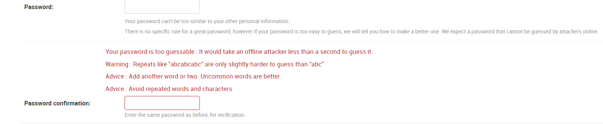
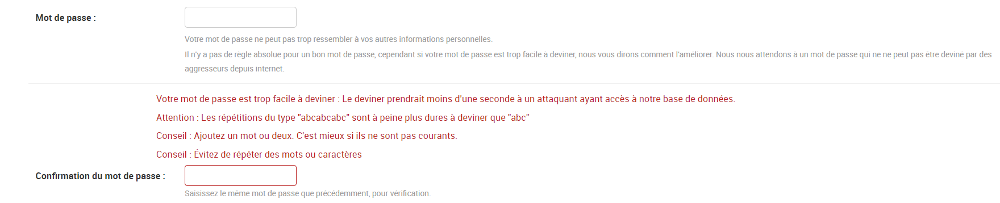

# django-zxcvbn-password-validator

A translatable password validator for django, based on zxcvbn-python and available with
pip.

Professional support for django-zxcvbn-password-validator is available as part of the
[Tidelift Subscription](https://tidelift.com/subscription/pkg/pypi-django-zxcvbn-password-validator?utm_source=pypi-django-zxcvbn-password-validator&utm_medium=referral&utm_campaign=enterprise)

[](https://github.com/Pierre-Sassoulas/django-zxcvbn-password-validator/actions?branch=main)
[](https://coveralls.io/github/Pierre-Sassoulas/django-zxcvbn-password-validator?branch=master)
[](https://badge.fury.io/py/django-zxcvbn-password-validator)
[](https://djangopackages.org/packages/p/django-zxcvbn-password-validator/)

## Translating the project

This project is available in multiple languages. Your contribution would be very
appreciated if you know a language that is not yet available or if you want to improve
an existing translation (especially AI-generated ones). See
[how to contribute](CONTRIBUTING.md)

### Language available

The software is developed in English. Other available languages are:

[](https://hosted.weblate.org/engage/django-zxcvbn-password-validator/)

Translators:

<details>
- [x] [Andrés Martano](https://github.com/andresmrm/): Brazilian Portuguese
- [x] [Lionel Sausin](https://github.com/ls-initiatives): French
- [x] [Michal Čihař](https://github.com/nijel/): Czech
- [x] [Pierre Sassoulas](https://github.com/Pierre-Sassoulas/): French
- [x] [RViktor](https://github.com/rviktor/): Hungarian
- [x] [Thom Wiggers](https://github.com/thomwiggers/): Dutch
- [x] Claude AI: Afrikaans, Akan, Albanian, Amharic, Arabic, Armenian, Assamese,
      Azerbaijani, Basque, Belarusian, Bengali, Bosnian, Brazilian Portuguese
      (corrections), Breton, Bulgarian, Burmese, Cantonese, Catalan, Cebuano, Chichewa,
      Chinese Simplified, Chinese Traditional, Corsican, Croatian, Danish, Esperanto,
      Estonian, Ewe, Faroese, Filipino, Finnish, Fulah, Galician, Georgian, German, Greek,
      Gujarati, Hausa, Hawaiian, Hebrew, Hindi, Icelandic, Igbo, Indonesian, Irish,
      Italian, Japanese, Javanese, Kannada, Kazakh, Khmer, Kinyarwanda, Kirundi, Korean,
      Kurdish, Kyrgyz, Lao, Latin, Latvian, Lingala, Lithuanian, Luganda, Luxembourgish,
      Macedonian, Malagasy, Malay, Malayalam, Maltese, Maori, Marathi, Mongolian, Nepali,
      Northern Ndebele, Northern Sami, Norwegian Bokmål, Occitan, Odia, Oromo, Pashto,
      Persian, Polish, Portuguese, Punjabi, Romanian, Russian, Samoan, Sango, Sardinian,
      Scottish Gaelic, Serbian, Sesotho, Shona, Sindhi, Sinhala, Slovak, Slovenian, Somali,
      Southern Ndebele, Spanish, Sundanese, Swahili, Swati, Swedish, Tajik, Tamil, Telugu,
      Thai, Tibetan, Tigrinya, Tongan, Tsonga, Tswana, Turkish, Turkmen, Twi, Ukrainian,
      Urdu, Uzbek, Venda, Vietnamese, Welsh, Western Frisian, Wolof, Xhosa, Yiddish,
      Yoruba, Zulu
- [x] English

</details>

## Creating a user with django-zxcvbn-password-validator

If the password is not strong enough, we provide errors explaining what you need to do :



The error message are translated to your target language (even the string given by
zxcvbn that are in english only) :



## Compatibility

Requires Django 2+ and Python 3.6+. Note that Python 3.6 and 3.7 are not tested in CI
anymore (GitHub Actions no longer provides runners for them), so while they should work,
there is no guarantee.

## How to use

Add `django-zxcvbn-password-validator` to your requirements and get it with pip. Then
everything happens in your settings file.

Add `'django_zxcvbn_password_validator'` in the `INSTALLED_APPS` :

```python
INSTALLED_APPS = [
    # ...
    "django_zxcvbn_password_validator"
]
```

Modify `AUTH_PASSWORD_VALIDATORS` :

```python
AUTH_PASSWORD_VALIDATORS = [
    {
        "NAME": "django.contrib.auth.password_validation.UserAttributeSimilarityValidator",
    },
    {
        "NAME": "django_zxcvbn_password_validator.ZxcvbnPasswordValidator",
    },
    # ...
]
```

You could choose to use zxcvbn alone, but I personally still use Django's
`UserAttributeSimilarityValidator`, because there seems to be still be some problem with
it integrating user information with zxcvbn (as of june 2018).

Finally, you can set the `PASSWORD_MINIMAL_STRENGTH` to your liking (default is 2),
every password scoring lower than this number will be rejected :

```python
# 0 too guessable: risky password. (guesses < 10^3)
# 1 very guessable: protection from throttled online attacks.
# (guesses < 10^6)
# 2 somewhat guessable: protection from unthrottled online attacks.
# (guesses < 10^8)
# 3 safely unguessable: moderate protection from offline slow-hash scenario.
# (guesses < 10^10)
# 4 very unguessable: strong protection from offline slow-hash scenario.
# (guesses >= 10^10)
PASSWORD_MINIMAL_STRENGTH = 0 if DEBUG else 4
```
